# The database of _CatDat_

## Overview

_CatDat_ is based on a [SQLite database](https://sqlite.org/). During runtime of the application, it is read-only.

During development, the database is located in the file `/database/local.db`. It has three main tables:

- `categories`
- `properties`
- `implications`

To associate (non-)properties with categories, there are two tables:

- `category_properties`
- `category_non_properties`

To mark properties as assumptions or conclusions of an implication, there are two tables:

- `implication_assumptions`
- `implication_conclusions`

But they are abstracted away by using the view `implications_view`.

Further tables are:

- `tags`
- `category_tags`
- `related_categories`
- `prefixes`
- `category_isomorphisms`
- `category_epimorphisms`
- `category_monomorphisms`
- `related_properties`
- `category_comments`

## Derived Data

From the defined properties for a given category, new properties can be derived automatically by using the implications (the same holds for non-properties). Also, suitable implications may be dualized. Notice that the migration files (see below) do _not_ contain derived data.

## Migrations

The database is built up incrementally and updated with the help of migration files in the folder [/database/migrations](/database/migrations/). The command `pnpm db:update` runs the migrations that are not yet applied, deduces implications and properties, and checks if the changes are sound.

## Diagram

```mermaid
erDiagram
    categories {
        text id PK
        text name
        text notation
        text objects
        text morphisms
        text description
        text nlab_link
        text created_at
    }

    category_comments {
        integer id PK
        text category_id FK
        text comment
        text created_at
    }

    category_epimorphisms {
        text category_id FK
        text description
        text reason
        text created_at
    }

    category_isomorphisms {
        text category_id FK
        text description
        text reason
        text created_at
    }

    category_monomorphisms {
        text category_id FK
        text description
        text reason
        text created_at
    }

    category_non_properties {
        text category_id FK
        text non_property_id FK
        text reason
        integer is_deduced
        integer position
        text created_at
    }

    category_properties {
        text category_id FK
        text property_id FK
        text reason
        integer is_deduced
        integer position
        text created_at
    }

    category_tags {
        text category_id FK
        text tag FK
        text created_at
    }

    implications {
        text id PK
        text reason
        integer is_equivalence
        integer is_deduced
        text created_at
    }

    implication_assumptions {
        text implication_id FK
        text property_id FK
        text created_at
    }

    implication_conclusions {
        text implication_id FK
        text property_id FK
        text created_at
    }

    migrations {
        text file PK
        text applied_at
    }

    prefixes {
        text prefix PK
        text negation
        text created_at
    }

    properties {
        text id PK
        text prefix FK
        text description
        text nlab_link
        integer invariant_under_equivalences
        text dual_property_id FK
        text created_at
    }

    related_categories {
        text category_id FK
        text related_category_id FK
        text created_at
    }

    related_properties {
        text property_id FK
        text related_property_id FK
        text created_at
    }

    tags {
        text tag PK
        text description
        text created_at
    }

    categories ||--o{ category_comments : has
    categories ||--o{ category_epimorphisms : has
    categories ||--o{ category_isomorphisms : has
    categories ||--o{ category_monomorphisms : has
    categories ||--o{ category_non_properties : has
    categories ||--o{ category_properties : has
    categories ||--o{ category_tags : has
    categories ||--o{ related_categories : related_to

    properties ||--o{ category_non_properties : referenced_by
    properties ||--o{ category_properties : referenced_by
    properties ||--o{ implication_assumptions : used_in
    properties ||--o{ implication_conclusions : used_in
    properties ||--o{ related_properties : related_to
    prefixes ||--o{ properties : has

    implications ||--o{ implication_assumptions : has
    implications ||--o{ implication_conclusions : has

    tags ||--o{ category_tags : tagged_by
```

